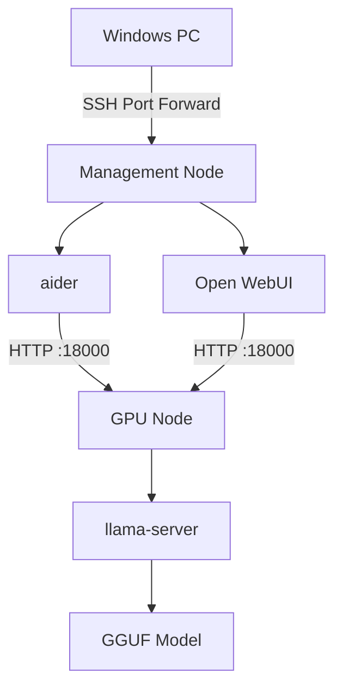

# llama-cpp-container

Containerized llama.cpp environment for HPC clusters using Apptainer/Singularity.

This project provides a reproducible environment for running GGUF models on NVIDIA GPUs together with:

- llama-server (OpenAI-compatible API)
- aider
- Open WebUI
- Hugging Face Hub
- uv-based Python environment

Designed for Slurm-managed HPC environments.

---

# Features

- CUDA-enabled llama.cpp
- Single GPU execution (H100 tested)
- GGUF model support
- OpenAI-compatible REST API
- aider integration
- Open WebUI integration
- Apptainer/Singularity compatible
- Configuration separated from repository
- GitHub Actions automatic container build

---

# Directory structure

```
.
├── config
│   ├── llama-server.conf
│   └── model.conf.example
│
├── scripts
│   ├── run-container-gpu.sh
│   ├── run-container-cpu.sh
│   ├── run-server.sh
│   ├── run-aider.sh
│   ├── run-openwebui.sh
│   ├── run-slurm.sh
│   ├── run-interactive.sh
│   └── start-server.sh
│
├── Dockerfile
├── pyproject.toml
├── uv.lock
└── README.md
```

---

# Requirements

- NVIDIA GPU
- CUDA Driver
- Apptainer (Singularity)
- Slurm (recommended)

---

# Download container

```
apptainer pull llama-cpp-container_latest.sif docker://<YOUR_IMAGE>
```

---

# User configuration

Create a user-specific configuration.

```
mkdir -p ~/.config/llama-cpp-container

cp config/model.conf.example \
   ~/.config/llama-cpp-container/model.conf
```

Edit

```
~/.config/llama-cpp-container/model.conf
```

Example

```ini
MODEL=/models/Qwen3.6-35B-A3B/Qwen3.6-35B-A3B-Q8_0.gguf

LLM_SERVER_HOST=gpu001

LLM_SERVER_PORT=18000

OPENAI_API_BASE=http://${LLM_SERVER_HOST}:${LLM_SERVER_PORT}/v1

OPENAI_API_KEY=dummy

OPENWEBUI_HOST=0.0.0.0
OPENWEBUI_PORT=3000
```

---

# Model directory

Recommended layout

```
$HOME/
└── models
    └── Qwen3.6-35B-A3B
        └── Qwen3.6-35B-A3B-Q8_0.gguf
```

---

# GPU node

Enter the container

```
bash scripts/run-container-gpu.sh
```

Start llama-server

```
bash /workspace/scripts/run-server.sh
```

The server listens on

```
http://<GPU_NODE>:18000
```

---

# Management node

Enter the container

```
bash scripts/run-container-cpu.sh
```

---

## aider

```
bash /workspace/scripts/run-aider.sh
```

aider connects automatically to the GPU node using the settings in

```
~/.config/llama-cpp-container/model.conf
```

---

## Open WebUI

```
bash /workspace/scripts/run-openwebui.sh
```

Open your browser

```
http://localhost:3000
```

---

# Windows SSH port forwarding

Example

```
ssh \
    -L 3000:localhost:3000 \
    user@management-node
```

Then open

```
http://localhost:3000
```

Open WebUI communicates with

```
http://<GPU_NODE>:18000/v1
```

internally.

No model data leaves the HPC cluster.

---

# Interactive shell

```
bash /workspace/scripts/run-interactive.sh
```

Displays

- Python version
- aider version
- llama-server version
- mounted models

---

# Configuration

## llama-server

```
config/llama-server.conf
```

Shared runtime configuration.

---

## User configuration

```
~/.config/llama-cpp-container/model.conf
```

Contains

- model path
- GPU node hostname
- API endpoint
- Open WebUI configuration

This file is intentionally excluded from Git.

---

# Data persistence

Recommended

```
~/.config/llama-cpp-container/
```

```
~/.local/share/open-webui/
```

The latter stores

- chat history
- settings
- user database

---

# Typical workflow

GPU node

```
bash run-container-gpu.sh

bash /workspace/scripts/run-server.sh
```

Management node

```
bash run-container-cpu.sh

bash /workspace/scripts/run-aider.sh
```

or

```
bash /workspace/scripts/run-openwebui.sh
```

Windows

```
Browser

↓

http://localhost:3000
```

---

# License

MIT License